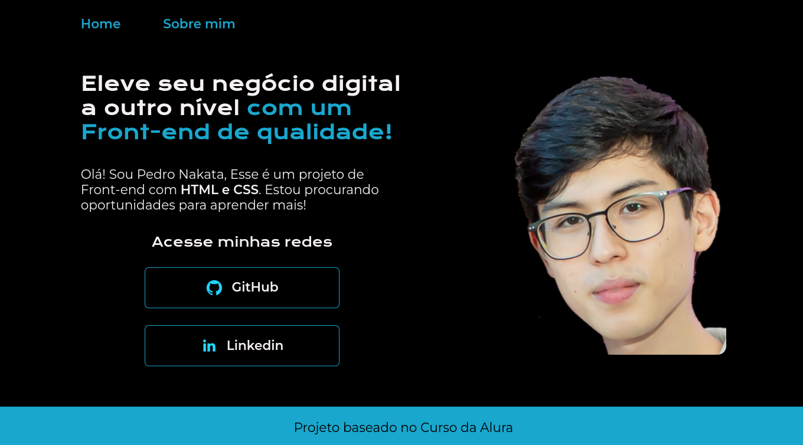

# Portfólio

Projeto do Curso de HTML/CSS da Alura

## Ferramentas utilizadas:

* HTML

* CSS

## Certificados

O Projeto faz parte de cursos sequenciais, segue os cursos:

* HTML e CSS: ambientes de desenvolvimento, estrutura de arquivos e tags (Finalizado)
* HTML e CSS: Classes, posicionamento e Flexbox (Finalizado)
* HTML e CSS: cabeçalho, footer e variáveis CSS (Finalizado)
* HTML e CSS: trabalhando com responsividade e publicação de projetos (Finalizado)

## Tarefas

Ainda é necessario melhorar a responsividade no mobile, modificando as distancias, tamanho, fontes.

## Criador

### Pedro Henrique Nakata

 Começei o projeto desdo o curso 1, atualizando passo-a-passo até o curso 4 final. 

## Links dos materiais

* [Curso HTML/CSS da Alura](https://cursos.alura.com.br/course/html-css-responsividade-publicacao-projetos)

* [Github do Curso](https://github.com/alura-cursos/Portifolio-HTML-e-CSS-Curso4/tree/aula_4)

* [Figma do Portfolio](https://www.figma.com/file/NrzJacC887svMVfF9oC2jM/Portfolio-Projeto-2?node-id=8-2&t=JbvLRMwru9OYR8Xu-0)

* [Guia para flexbox](https://css-tricks.com/snippets/css/a-guide-to-flexbox/)
